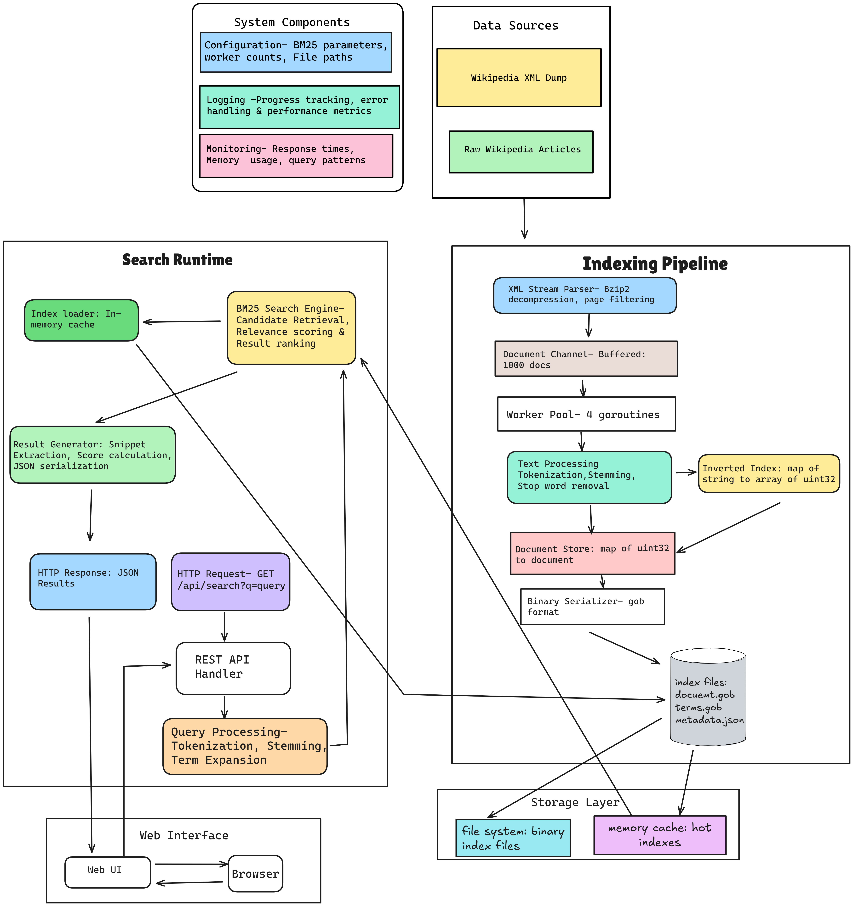

# Wikipedia Search Engine

A full-featured search engine built from scratch, implementing the BM25 ranking algorithm for searching Wikipedia content. This project demonstrates advanced information retrieval concepts, systems architecture, and performance optimization without relying on existing search frameworks like <b>Elasticsearch</b> or <b>Solr</b>.

## Project Overview 
This search engine processes 20,000+ Wikipedia articles and provides sub-second query response times using a custom-built inverted index and BM25 relevance ranking. The entire system is built from the ground up to understand the fundamental concepts behind modern search engines.

### Demo 🏄‍♂️


### Key Features

- **Custom BM25 Implementation**: Industry-standard ranking algorithm for relevance scoring
- **Inverted Index**: Efficient term-to-document mapping with frequency storage
- **Full-Text Search**: Search across article titles and content with multi-term query support
- **Advanced Text Processing**: Tokenization, stemming (Porter algorithm), and stop-word removal
- **Concurrent Processing**: Multi-threaded indexing pipeline for optimal performance
- **Binary Serialization**: Efficient storage using Go's gob format
- **REST API**: JSON endpoints for programmatic access
- **Web Interface**: Clean, responsive UI for interactive searching

## 📊 Technical Specifications

### Performance Metrics
- **Dataset**: 20,000+ Wikipedia articles
- **Index Size**: ~150-200MB on disk
- **Query Response Time**: <100ms average
- **Memory Usage**: <1GB during operation
- **Processing Rate**: ~60 documents/second during indexing

### Technology Stack
- **Language**: Go 1.21+
- **Web Framework**: Gorilla Mux
- **Text Processing**: Snowball stemming library
- **Storage**: Binary serialization (gob format)
- **Architecture**: Concurrent producer-consumer pattern

## High Level Architecture



### Components
 <b> 1.Indexing Pipeline </b>
```
Wikipedia XML → Stream Parser → Worker Pool → Text Processor → Inverted Index → Disk Storage
```

The indexing pipeline processes Wikipedia XML dumps through several stages:
- **Stream Parser**: Reads compressed XML files without loading entire dataset in memory
- **Worker Pool**: 2-4 concurrent goroutines for parallel document processing
- **Text Processor**: Tokenization, stemming, and term frequency calculation
- **Index Builder**: Creates inverted index mapping terms to document IDs
- **Storage Layer**: Serializes indexes to disk in binary format

 <b>2. Search Pipeline </b>
```
User Query → Tokenizer → Stemmer → Index Lookup → BM25 Scoring → Result Ranking → JSON Response
```

The search pipeline handles real-time queries:
- **Query Processing**: Tokenizes and stems user input
- **Candidate Retrieval**: Looks up documents containing query terms
- **BM25 Scoring**: Calculates relevance scores based on term frequency and document statistics
- **Result Generation**: Extracts snippets and formats results
- **API Response**: Returns ranked results as JSON

## Algorithm Deep Dive
### BM25 (Best Matching 25)

The core ranking algorithm implements BM25, which considers:

```
score(D,Q) = Σ IDF(qi) × (f(qi,D) × (k1 + 1)) / (f(qi,D) + k1 × (1 - b + b × |D| / avgdl))
```

Where:
- `f(qi,D)` = term frequency of query term qi in document D
- `|D|` = length of document D in tokens
- `avgdl` = average document length in the corpus
- `k1` = 1.2 (term frequency saturation parameter)
- `b` = 0.75 (length normalization parameter)
- `IDF(qi)` = inverse document frequency of term qi

**Why BM25?**
- More effective than TF-IDF for ranking
- Handles document length bias
- Industry standard (used by Elasticsearch, Lucene)
- Parameter-tunable for different content types

### Text Processing Pipeline

1. **Tokenization**: Extract words using regex pattern matching
2. **Normalization**: Convert to lowercase, remove punctuation
3. **Stop Word Removal**: Filter common words (the, and, or, etc.)
4. **Stemming**: Reduce words to root forms using Porter stemming
   - "running" → "run"
   - "algorithms" → "algorithm"
   - "intelligence" → "intellig"

## Getting Started
### Prerequisites

- Go 1.21 or higher
- 500MB+ disk space for indexes
- Wikipedia data dump (included in setup)

### Installation

1. **Clone the repository**
```bash
git clone https://github.com/Adit0507/wiki-search-engine.git
cd wiki-search-engine
```

2. **Install dependencies**
```bash
go mod tidy
``` 

3. **Download Wikipedia data**
```bash
mkdir -p data/wikipedia
cd data/wikipedia
```

4. **Go to Wikimedia dump and download .bz2 dump**

Click <a href="https://dumps.wikimedia.org/enwiki/latest/">Here</a> to download the data dump 

<i>I went with the <b>enwiki-latest-pages-articles1.xml-p1p41242.bz2 </b> due to some system limitations, if u want the entire data dump go with <b>enwiki-latest-pages-articles1.xml-p1p41242.bz2 (around 23GB)</b> </i>

Make sure to place the data dump inside <b>data/wikipedia</b>

### Building the Index
````
go build -o bin/indexer cmd/indexer/main.go
````

<b>Running Indexer(will take some time) </b>
````
 go run cmd/indexer/main.go -data ./data/wikipedia -index ./indexes -workers 4

# You should see:
# Processing file: data/wikipedia/enwiki-latest-pages-articles1.xml-p1p41242.bz2
# Processed 1000 documents...
# Processed 2000 documents...
# ...
# Building index...
# Saving to disk...
# Indexing completed successfully!

````

**Indexing Parameters:**
- `-data`: Path to Wikipedia XML files
- `-index`: Directory to store generated indexes
- `-workers`: Number of concurrent processing threads

6. **Run the Server**
````````
go run cmd/server/main.go -index ./indexes -port 8080
````````
## 📖 Usage

### Web Interface

1. Open your browser and navigate to `http://localhost:8080`
2. Enter a search query (e.g., "artificial intelligence")
3. View ranked results with relevance scores and snippets

### REST API

#### Search Endpoint
```bash
GET /api/search?q={query}&limit={limit}
```

**Parameters:**
- `q`: Search query (required)
- `limit`: Maximum number of results (default: 10)


**Built with ❤️**